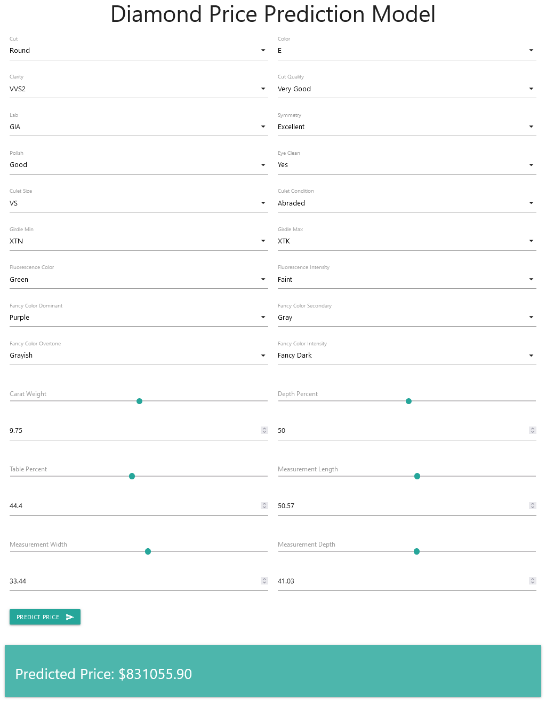

# Diamond Price Prediction

This project implements a machine learning model to predict diamond prices based on various characteristics. It uses a dataset from Kaggle and provides a web interface for users to input diamond features and receive price predictions.



## Dataset

The dataset used in this project is "The Largest Diamond Dataset Currently on Kaggle" by Hrokrin. You can find the original dataset [here](https://www.kaggle.com/datasets/hrokrin/the-largest-diamond-dataset-currely-on-kaggle).

## Features

- Predicts diamond prices based on multiple features such as cut, color, clarity, carat weight, and more.
- Web interface for easy interaction with the model.
- Uses Random Forest Regressor for predictions.
- Implements feature engineering to improve prediction accuracy.

## Installation

You can run this application using Docker. The Docker image is available on Docker Hub.

To run the application:

```bash
docker pull pouryare/diamond-price-predictor:latest
docker run -p 8080:8080 pouryare/diamond-price-predictor:latest
```

The application will be available at `http://localhost:8080`.

## Usage

1. Access the web interface at `http://localhost:8080`.
2. Enter the diamond characteristics in the provided form.
3. Submit the form to receive a price prediction.

## Project Structure

- `main.py`: Flask application that serves the web interface and handles predictions.
- `model.py`: Contains the machine learning model and preprocessing functions.
- `templates/index.html`: HTML template for the web interface.
- `Dockerfile`: Used to build the Docker image for this application.

## Contributing

Contributions to this project are welcome! Please fork the repository and submit a pull request with your changes.

## License

This project is open source and available under the [MIT License](LICENSE).

## Acknowledgments

This project was inspired by various works in the field of diamond price prediction and machine learning. We acknowledge the contributions of the open-source community and the creators of the libraries and tools used in this project.

## Contact

For any questions or feedback, please open an issue on this GitHub repository.
